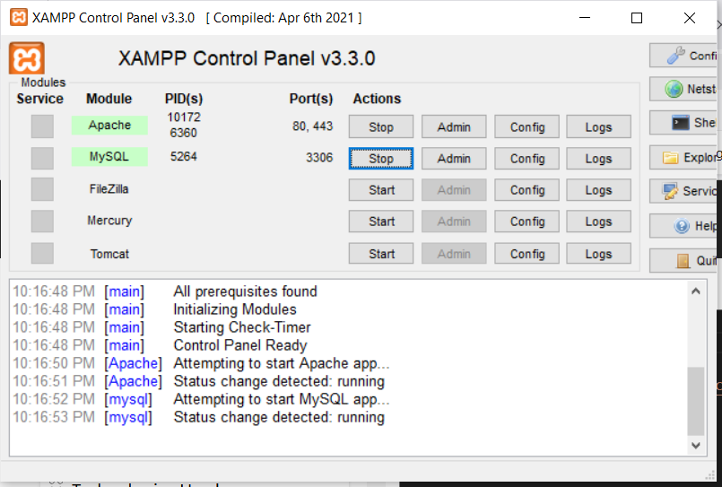
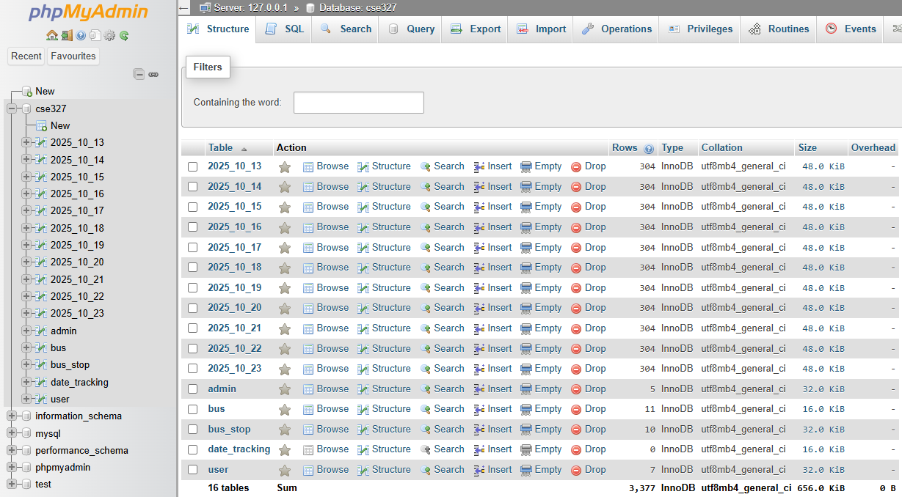
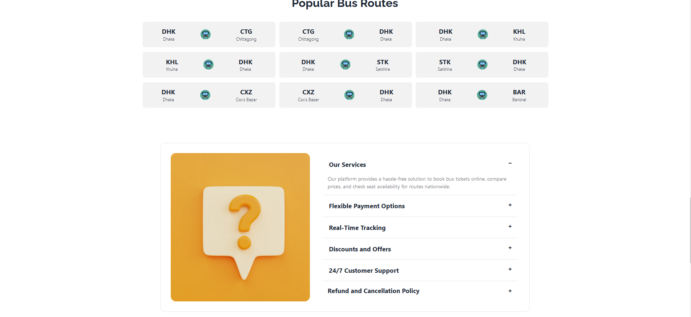
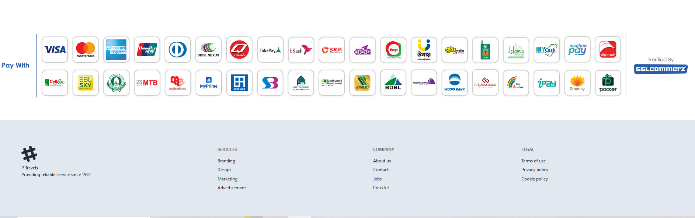
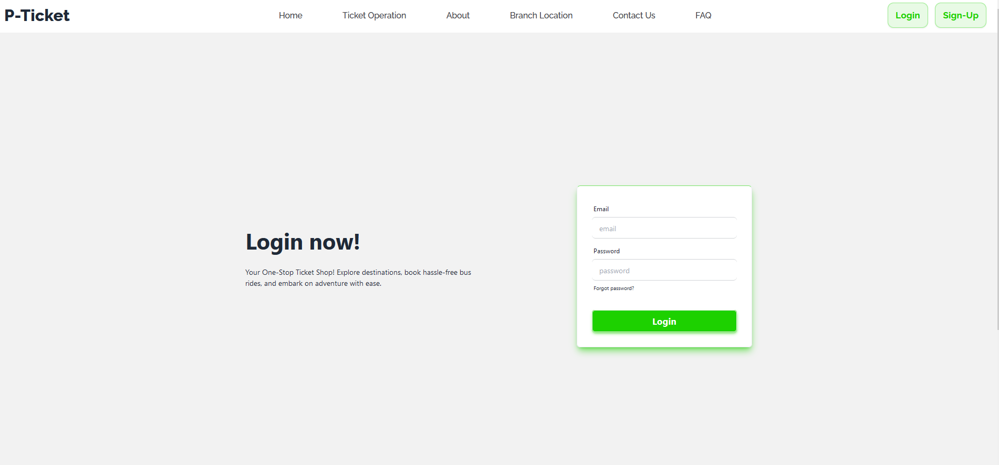
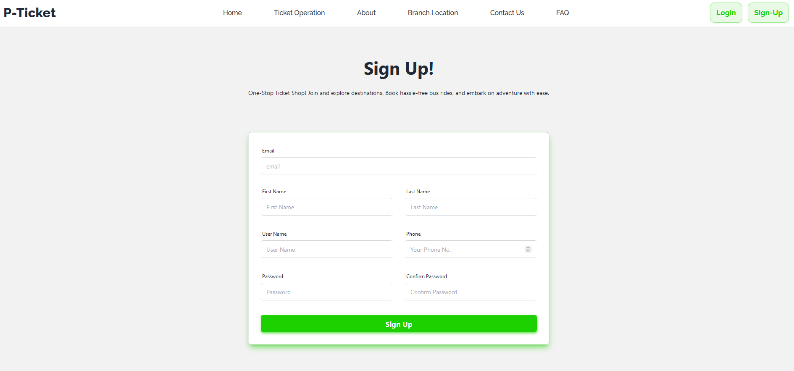

# 🚌 Online Bus Ticket Booking System

The Online Bus Ticket Booking System is a web-based application designed to provide a seamless and efficient platform for booking bus tickets. It simplifies the process for passengers and streamlines management tasks for administrators. With a user-friendly interface and robust functionality, this system enhances the overall experience of bus travel.

## 🛠️ Technologies Used

    Frontend: HTML, TailWind-CSS, Raw PHP
    Backend: PHP
    Database: MySQL 
    Additional Tools: XAMMP(DBMS)
## 🚀 Features
For Passengers:

    🔍 Search Buses:
    - User can Search Buses From --> To Location with Coach Type and Date Based.

    🚌 Dynamic Bus:
      - For Dynamic Bus Time, We work with two predefined location_time for a specific Location with predefined location_level(e.x 1,2,3...) 
        so, that user can search from specific bus stop location.
        (E.X  Dhaka - Jessore - Benapole location buses .User can search

     Dhaka    -> Benapole
     Dhaka    -> Jessore
     Jessore  -> Benapole
     Jessore  -> Dhaka
     Benapole -> Jessore
     Benapole -> Dhaka
     Benapole -> Jessore 
     Dhaka    -> Tangail
     Tangail  -> Dhaka
     Dhaka    -> Narayangonj etc
     )

    🪑 Good Looking UI with Dynamic Seat Map:
      - we work with AC(24 seats) and Non AC(32 Seats) So that we handle dynamic seat map for ac and Non Ac Buses.
      - Look At Below Screen Shots for ticketPanel.php file. 
      - User can select one or more than one seats at a time .
      - Also they can cancel those selected seats and Confirm.
      - User Can't select previous booked seats.
      - We Handle dynamic Ticket Price calculation. 

    💳 Secure Payments: 
        - No actual Payment option But in Future, Inshallah We will work on it.

    ✅ Refundable Options:
       - A User can refund his/her tickets based on booking Dates.They Have to cancel there ticket before 2 days at least.

    📂 Manage Bookings:
      - View booking history, upcoming trips, and cancel or modify reservations.

For Administrators:

🛠️ Bus Management: 
     - Add, update, and manage bus details, schedules, and routes.

🎟️ Booking Overview:
 Monitor bookings and ticket availability.

🖥️ Dynamic Updates:
 - we record total 12 days of bus and ticket information(Dynamically.
 - So that User can Booked advance ticket  5 days before.
 - Admin has the accaccess to see the previous 6 days record.
 - Every Day the date_name_table will updated autoautomatically and remove the last previous date_name_table.
## 💡 How to Run the Project

# 

# create a database named 'cse327project' on phpMyAdmin

Import The sql file on XAMMP phpMyAdmin Server

## After Import database

## Review Of The Website

## Future Improvement
   - Real-time Ride Tracking -------- ( Map showing pickup & drop-off locations. Distance calculation )
   - Notification System ------------ ( Email or SMS notification when a booking is confirmed. Alerts for ride updates or cancellations )
   - Rating & Review System ----------( Ratings for drivers. Comments after a ride )
   - Driver Verification -------------( improves security & reduces fake accounts )
   - Chat / Messaging System ---------( between driver and passenger )
   - Advanced Search Filters Time ----( Vehicle type, Seats available, Price, Driver ratings )

--------------------------------
##  Team Members  
-------------------------

|            Name            |            ID         |
|----------------------------|-----------------------|
|  MD Naimul Hasan Munna     |        2122119642     |
|  Nusrat Jahan Noor         |        2121995642     |
|  Nusrat Jahan  Othoi       |        2111477642     |
                                                
## Instructor: Professor Dr. Md. Sazzad Hossain ( MDSH )
## Email: sazzad.hossain14@northsouth.edu
## North South University.
